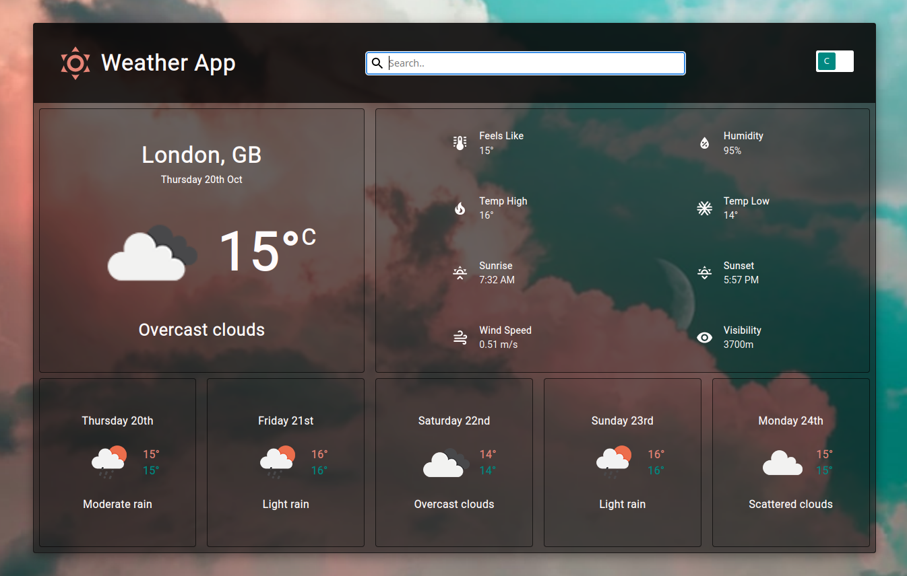

# weather-app

A weather app built with HTML, SCSS and asynchronous JavaScript (via Webpack). Has an async menu and returns a 5 day weather forecast with images for different weather states.

[Demo here](https://casssb.github.io/weather-app/)

## Tech Used
* Vanilla HTML, JS & SCSS
* Openweather API, Geoapify API, Geolocation API
* NPM & Webpack
* Date-fns
* Sanitize CSS (for reset)

## Thoughts
My aims for this project were to become comfortable with promises and async/await and I feel like learning these core concepts came pretty easily. Managing the interactions between multiple API calls and their associated state was much more difficult! I think I probably spent more time reading about debouncing and throttling than on all the basic API calls put together! I also decided to add SCSS and can see the benefit of using mixins and nesting (although it feels like most of it’s other features are now included in regular CSS?).

## Possible Improvements
* I ended up using the free version of Openweather’s API but after looking through the docs their ‘Onecall’ version looked way better. You may have noticed that the high/low temps are the same for the forecast projections. This is because I ended up just filtering the 5 day 3 hour forecast so each of the 5 day cards are for 3 hour periods only! I actually looked through various other weather API’s but none had a free version with a decent amount of allowed calls (which I used during production).
* I may go back and add an option to close the search menu by clicking outside of the box. I did add a close ‘X’ button but modal type forms that cannot be closed with a random click are not the best user experience.
* I was thinking about changing the background image based on the weather description although this means adjusting the overall colour themes so I decided against it.
* My OOP structure (modules) are not the best and are coupled in several areas. My goal was to make the API module the main controller with others subscribing to it. I think due to my lack of experience with managing async state I ended up making my code more confusing to read than I’d like.

## Credits
* Weather API from [Openweather](https://openweathermap.org/api)
* Geocoding API from  [Geoapify](https://www.geoapify.com/geocoding-api)
* SVG icons from [Material Design](https://materialdesignicons.com/)
* Fluid CSS scaling defaults from [fluid-type-scale.com](https://www.fluid-type-scale.com/)
* Project idea from [The Odin Project](https://www.theodinproject.com/lessons/node-path-javascript-todo-list)